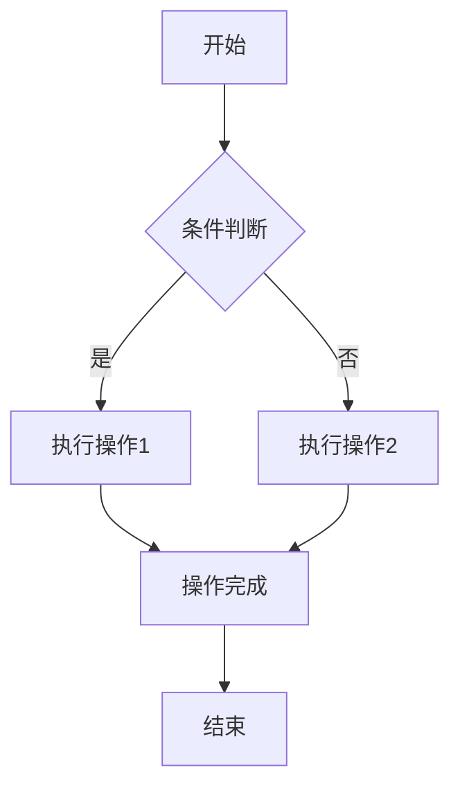
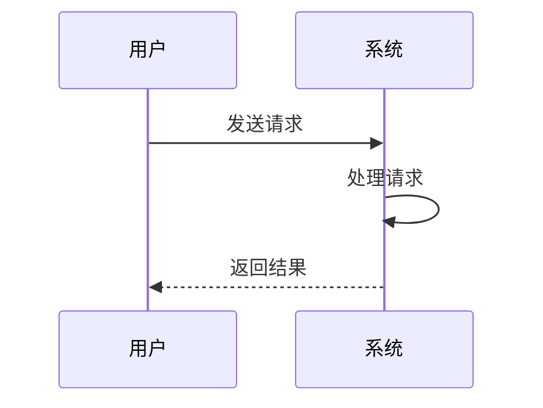

# Markdown 测试

## 标题测试

### 三级标题
这是三级标题的内容

#### 四级标题
四级标题用于更细分的内容

## 文本格式测试

**粗体文本**：这里应该显示为粗体  
*斜体文本*：这里应该显示为斜体  
***粗斜体文本***：同时具备粗体和斜体效果  
~~删除线文本~~：这里应该有删除线效果

## 列表测试

### 无序列表
- 第一项
- 第二项
  - 二级无序列表
  - 二级无序列表第二项
- 第三项

### 有序列表
1. 第一个有序项
2. 第二个有序项
   1. 二级有序列表
   2. 二级有序列表第二项
3. 第三个有序项

## 代码块测试

### 行内代码
`console.log('Hello World')` 这是一个行内代码示例

### 代码块
```javascript
function testFunction() {
  const message = '这是一个代码块测试';
  console.log(message);
  
  for (let i = 0; i < 5; i++) {
    console.log(`循环第 ${i + 1} 次`);
  }
}
```

```python
def test_function():
    message = "这是一个Python代码块"
    print(message)
    
    for i in range(5):
        print(f"循环第 {i+1} 次")
```

## 表格测试

| 表头1       | 表头2       | 表头3       |
|------------|------------|------------|
| 单元格内容 | 单元格内容 | 单元格内容 |
| 第二行数据 | 第二行数据 | 第二行数据 |
| 第三行数据 | 第三行数据 | 第三行数据 |

## 引用测试

> 这是一个引用测试
> 引用内容可以有多行
> 
> —— 引用来源

## 链接与图片测试

### 链接
[百度](https://www.baidu.com)  
[Google](https://www.google.com "Google链接")

### 图片


## 其他元素测试

### 水平线
---

### 任务列表
- [x] 已完成的任务
- [ ] 未完成的任务
- [x] 另一个已完成的任务

### 脚注
这是一个脚注示例[^1]

[^1]: 脚注的具体内容

## 数学公式测试（如果支持）

行内公式：$E=mc^2$

块级公式：
$$
\int_{0}^{\infty} x^n e^{-x} dx = n!
$$

## 流程图测试（如果支持）



## 时序图测试（如果支持）

